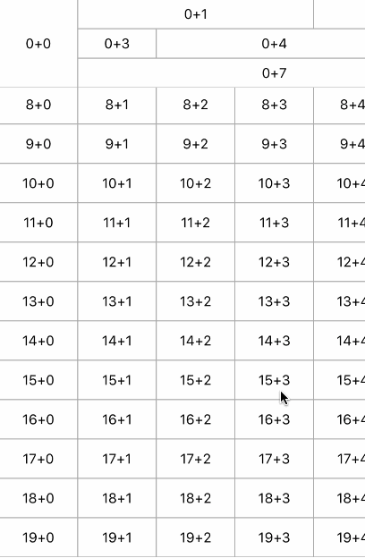
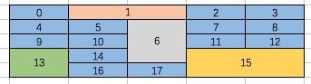

# MZFreeLayout

## 简介
MZFreeLayout的[Swift版本](https://github.com/MachelleZhang/MZTableLayout)<br>

自定义UICollectionView的Layout，实现类似Excel的功能。<br>


## 安装方法

在podfile中加入如下语句

```ruby
pod 'MZFreeLayout', '~> 1.0.0'
```

## 用法

e.g.<br>
<br>
在已知表格样式的前提下，按从左到右，从上到下，依次添加索引，已编号的掠过，参考上图的索引规则<br>

1.引入头文件

```Objective-C
#import "MZFreeLayout.h"
```

2.设置代理

```Objective-C
MZFreeLayout *freeLayout = [[MZFreeLayout alloc] init];
freeLayout.delegate = self;
```

3.需要实现的主要代理方法

```Objective-C
#pragma mark - MZFreeSheetLayoutDelegate
- (CGFloat)baseWidthOfCollectionView:(UICollectionView *)collectionView cellWidthOf:(NSInteger)index {
    return 40;
}

- (CGFloat)baseHeightOfCollectionView:(UICollectionView *)collectionView cellHeightOf:(NSInteger)index {
    return 50;
}

- (MZFreeModel *)scaleOfCollectionView:(UICollectionView *)collectionView {
    return [MZFreeModel initWithX:20 Y:20];
}

- (MZFreeModel *)mzCollectionView:(UICollectionView *)collectionView cellSizeOfIndex:(NSInteger)index {
    return [MZFreeModel initWithX:1 Y:1];
}

- (MZFreeModel *)frozenUnitOfCollection:(UICollectionView *)collectionView {
    return [MZFreeModel initWithX:0 Y:1];
}

#pragma mark - UICollectionViewDataSource
- (NSInteger)collectionView:(UICollectionView *)collectionView numberOfItemsInSection:(NSInteger)section {
    return 400;
}
```

## 版本更新历史
版本号|版本描述
---|---
0.1.0|从MZMultiHeadersSheet库分离出来
1.0.0|更换单元格宽度和高度的代理

## 作者

ZhangLe, 407916482@qq.com

## 开源证书

MZFreeLayout is available under the MIT license. See the LICENSE file for more info.
